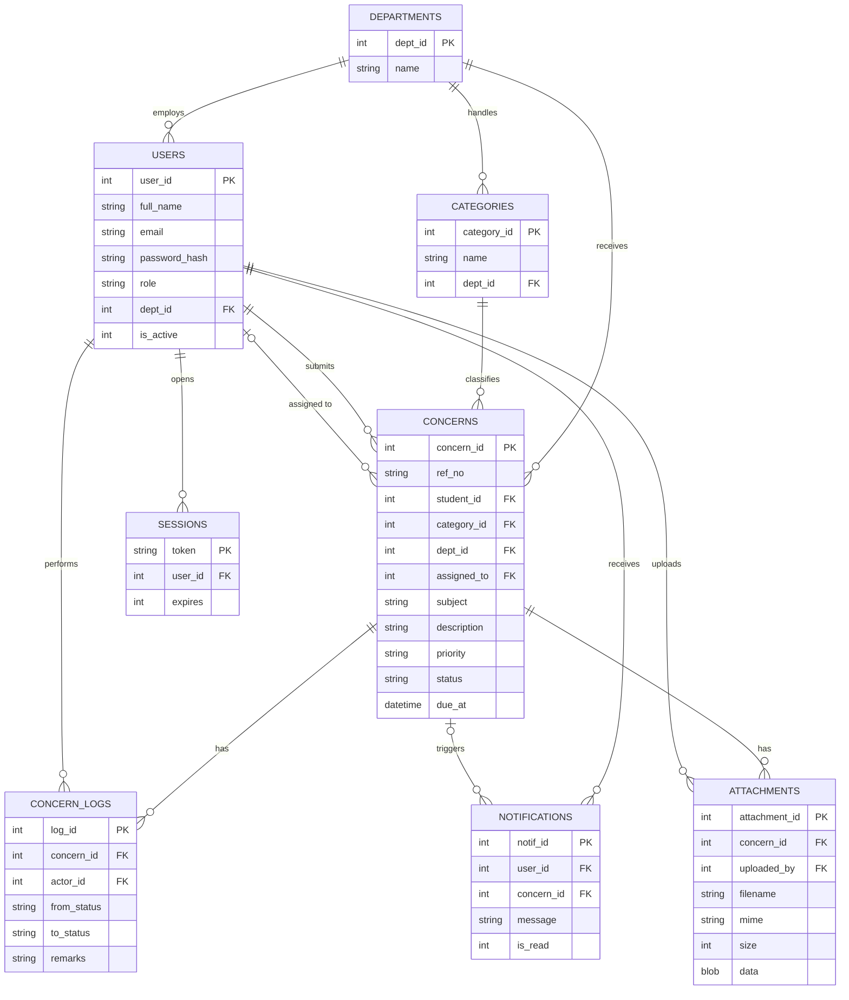

# Student Concern Routing & Resolution Tracking System

Students submit concerns → system **auto-routes** them to the right office → staff review, work and resolve → student confirms → full history, dashboard and CSV report.

## One-tap run
Install Node.js 22.13+ once, then **double-click** `start.bat` (Windows) or `start.command` (Mac; first time right-click → Open). Linux: `./start.sh`. The browser opens automatically.

## Run locally (manual)
Requires **Node.js 22.13+** (https://nodejs.org). No `npm install` needed locally (the `pg` package is only loaded when `DATABASE_URL` is set).
```
node server.js        # or: npm start
```
Open http://localhost:3000. The SQLite database (`data.db`) is created and seeded automatically.

| Role | Email | Password |
|---|---|---|
| Administrator | demo.admin@email.com | Demo@12345 |
| Student | demo.user@email.com | Demo@12345 |
| Staff (Registrar / Student Affairs / Finance / IT) | registrar@ · affairs@ · finance@ · it@`school.edu` | Demo@12345 |

Set `SEED_PASSWORD` before the first run to change the demo password (never commit real secrets).

## Deploy to production — see DEPLOY.md (includes a one-click render.yaml Blueprint)

### Summary
1. Push this folder to GitHub. 2. Render → **New Web Service** → pick repo. Build command: *(empty)*. Start command: `node server.js`. Environment: Node 22, `NODE_ENV=production`, `SEED_PASSWORD=<your demo password>`.
3. **Persistence (free):** create a free Neon Postgres database and set `DATABASE_URL` to its connection string (see DEPLOY.md). Without `DATABASE_URL` the app uses a local SQLite file, which a free Render service wipes on redeploy.
4. The app serves both frontend and API from one URL, so that URL is your *Public Production URL*, and the SQLite file on the disk is your *Production Database*.
> The app already supports a separate hosted PostgreSQL (Neon/Supabase/Aiven): set `DATABASE_URL` and it creates and seeds the tables automatically.

## Modules (requirement: 4+)
1. User & Account Management (register, admin-created staff, activate/deactivate) 2. Concern Submission & Routing 3. Concern Processing / Status Workflow 4. Monitoring Dashboard & Overdue Detection 5. History / Audit Trail 6. Notifications 7. Reporting (CSV export)

**Advanced features:** file/image attachments (PNG, JPG, PDF, DOC, DOCX, TXT; 2 MB, max 5 per concern; stored in the database so they persist with it), automatic routing + load-balanced assignment, overdue (SLA) detection, in-app notifications, CSV export, charts, audit trail.

## Business rules
- **BR1 Routing & access:** category → department decides the office; staff see only their department, students only their own concerns.
- **BR2 SLA:** Urgent = 1 day, Normal = 3, Low = 5; open concerns past due are flagged *overdue*.
- **BR3 Workflow:** Submitted → Under Review → In Progress → Resolved → Closed (student confirms or reopens); Rejected needs remarks; Resolved needs remarks; student may cancel/edit only while Submitted.
- **BR4:** a student may have at most 5 open concerns. Descriptions need 15+ characters.
- **BR5:** admins cannot deactivate themselves; deactivated users cannot log in.

## Functional requirements
FR1 Register/login/logout · FR2 Role-based access (student/staff/admin) · FR3 Submit concern · FR4 Auto-route by category · FR5 Assign to least-loaded staff · FR6 Update status with remarks · FR7 Student edit/cancel/confirm/reopen · FR8 Search, filter, sort · FR9 Dashboard · FR10 Overdue detection · FR11 Notifications · FR12 History/audit trail · FR13 CSV export · FR14 Manage users & routing rules.

## ERD (Crow's Foot) — paste into draw.io (Arrange → Insert → Advanced → Mermaid) or mermaid.live

CONCERN_LOGS is the audit trail. (Students and staff are both rows in USERS, distinguished by `role`.)

## DFD guide
**Context (1 process "Manage Student Concerns"):** Student → *Concern Details, Login Credentials, Confirmation/Reopen Request*; System → Student *Concern Status, Notifications*. Staff → *Status Update, Remarks*; System → Staff *Assigned Concerns*. Admin → *Account Details, Routing Rules*; System → Admin *Summary Report, Concern Export*.
**Level 0:** P1 Authenticate User (D1 Users) · P2 Submit Concern (D2 Concerns) · P3 Route Concern (D3 Categories/Departments, D2) · P4 Process Concern (D2, D4 Concern Logs) · P5 Send Notification (D5 Notifications) · P6 Generate Report (D2, D4) · P7 Manage Accounts & Routing (D1, D3).
**Level 1 (decompose P4 Process Concern):** P4.1 Retrieve Assigned Concern → P4.2 Validate Status Transition (business rule BR3) → P4.3 Update Concern Status (D2) → P4.4 Record History (D4) → P4.5 Notify Student (to P5). Inputs/outputs match P4 on Level 0 (Status Update, Remarks in; Concern Status, Notification Request out).

## Test cases
| # | Function | Expected | Result |
|---|---|---|---|
| TC01 | Valid login (demo.user) | Dashboard opens | |
| TC02 | Invalid login | "Invalid email or password" | |
| TC03 | Submit concern (valid) | Saved, routed to dept, ref no. shown | |
| TC04 | Submit description < 15 chars | Validation error | |
| TC05 | Edit concern while Submitted | Saved; after Under Review the Edit button is gone | |
| TC06 | Staff Rejects without remarks | Error: remarks required (BR3) | |
| TC07 | Staff moves Submitted→Under Review→In Progress→Resolved | Status + history updated, student notified | |
| TC08 | Student closes a Resolved concern | Status = Closed | |
| TC09 | Student tries to open another student's concern / staff other dept | 404 Not found (BR1) | |
| TC10 | Search "tuition", filter status, sort by due | Correct filtered rows | |
| TC11 | Overdue only filter | Shows overdue concern | |
| TC13 | Attach a PNG/PDF to a concern; try an .exe or a 3 MB file | Valid file listed and downloadable; invalid ones rejected | |
| TC12 | Refresh / logout / login again / redeploy | Records persist | |

## Tools used (edit to match your group)
Claude – development assistance · Draw.io / mermaid.live – DFD & ERD · Node.js + PostgreSQL (SQLite for local dev) – stack · Render – hosting.

## Security notes
Passwords hashed with scrypt + salt; HttpOnly session cookies; parameterised SQL; output escaped in UI; no secrets in code (use env vars).
